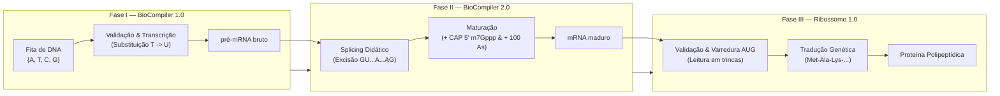

<div align="center">

# 🧬 Ribossomo & BioCompiler — Protein Translator

### Simulador Didático do Dogma Central da Biologia Molecular

[](https://react.dev/)
[](https://vitejs.dev/)
[](https://www.typescriptlang.org/)
[](https://tailwindcss.com/)
[](https://threejs.org/)
[](./LICENSE)

<p align="center">
  Uma plataforma interativa e educacional de bioinformática que simula em três fases completas o fluxo da informação genética eucariótica: transcrição de DNA, processamento e splicing de pré-mRNA, e tradução ribossômica em cadeia polipeptídica com renderização 3D em tempo real.
</p>

</div>

---

## 📌 Sumário

- [Visão Geral da Pipeline Biológica](#visão-geral-da-pipeline-biológica)
- [Funcionalidades Principais](#funcionalidades-principais)
  - [Fase I — BioCompiler 1.0 (DNA → pré-mRNA)](#fase-i--biocompiler-10-dna--pré-mrna)
  - [Fase II — BioCompiler 2.0 (pré-mRNA → mRNA maduro)](#fase-ii--biocompiler-20-pré-mrna--mrna-maduro)
  - [Fase III — Ribossomo 1.0 (mRNA maduro → Proteína)](#fase-iii--ribossomo-10-mrna-maduro--proteína)
  - [Modo Pipeline Unificado](#modo-pipeline-unificado)
  - [Tema Claro/Escuro](#tema-claroescuro)
  - [Alternância de Execução e Fallback Transparente](#alternância-de-execução-e-fallback-transparente)
- [Arquitetura e Estrutura do Projeto](#arquitetura-e-estrutura-do-projeto)
- [Stack Tecnológica](#stack-tecnológica)
- [Como Executar o Projeto](#como-executar-o-projeto)
- [Integração com Backend Python (FastAPI)](#integração-com-backend-python-fastapi)
- [Roteiro de Apresentação](#roteiro-de-apresentação)
- [Especificações em PDF como Fonte da Verdade](#especificações-em-pdf-como-fonte-da-verdade)
- [Interpretações Algorítmicas e Limitações Conhecidas](#interpretações-algorítmicas-e-limitações-conhecidas)
- [Licença](#licença)

---

## Visão Geral da Pipeline Biológica

O sistema modela o dogma central da biologia molecular em três etapas didáticas sucessivas, oferecendo tanto a execução passo a passo por fase quanto a resolução contínua de ponta a ponta:



---

## Funcionalidades Principais

<a id="fase-i--biocompiler-10-dna--pré-mrna"></a>
### Fase I — BioCompiler 1.0 (DNA → pré-mRNA)
- **Validação de Alfabeto:** Verificação estrita das bases canônicas `{A, T, C, G}` com identificação visual e indicação de coordenada humana da base inválida.
- **Detecção de Códon START:** Busca pela primeira ocorrência do códon iniciador `ATG`.
- **Análise do Quadro de Leitura:** Varredura em trincas a partir do `ATG` à procura de códons de parada (`TAA`, `TAG`, `TGA`).
- **Classificação Diagnóstica:**
  - `CORRETO`: Transcrição realizada com sucesso para pré-mRNA (`T` → `U`).
  - `ERRO`: Presença de anomalia biológica ou sintática (`BUG - base inválida`, `BUG - START ausente`, `BUG - STOP ausente`, `BUG - frameshift`, `BUG - nonsense / STOP prematuro`).
- **Processamento em Lote:** Entrada manual multi-linha ou importação de `.txt`, com download de `resultados.txt` no formato oficial `linha;status;resultado;pre_mRNA` (seção 11 da especificação), utilizado para correção automática.
- **Terminal Simulado:** Aba "Terminal", ao lado de "Relatório", com uma janela estilo Prompt de Comando que reproduz exatamente a saída de tela do programa de linha de comando (banner e blocos ENTRADA/STATUS/..., seções 9 e 14 da especificação), com botões para copiar e baixar `saida_terminal.txt`.
- **Régua de Posições:** No relatório, cada base da sequência aparece com sua posição numerada a partir de 1, colorida pela região (antes do START, região codificante, base inválida) e com as trincas agrupadas a partir do `ATG` para visualizar o quadro de leitura.
- **Fonte Normativa:** A Fase I segue "Especificações do BioCompiler 1.0 e slides.pdf" (em `BioCompiler2.0/biocompiler/`), com transcrição em `BioCompiler2.0/pdf_text_biocompiler1_v2.txt`.

<a id="fase-ii--biocompiler-20-pré-mrna--mrna-maduro"></a>
### Fase II — BioCompiler 2.0 (pré-mRNA → mRNA maduro)
- **Reconhecimento de Sinais de Splicing:** Identificação do sítio 5' `GU`, do sítio 3' `AG` e do ponto de ramificação (*branch point*) `A`.
- **Janela Restritiva de Branch Point:** Validação computacional estrita de adenina localizada entre 10 e 30 nucleotídeos antes do sítio terminal `AG`.
- **Splicing Iterativo:** Remoção sucessiva de íntrons no padrão `GU...A...AG` e junção direta dos éxons adjacentes.
- **Capeamento e Poliadenilação:** Adição da CAP 5' (`m7Gppp`) e da cauda poli-A calibrada para exatamente 100 adeninas (`A`).
- **Diagnósticos Oficiais:** Emissão rigorosa dos quatro status canônicos (`CORRETO`, `BUG - sítio 5' ausente`, `BUG - sítio 3' ausente`, `BUG - branch point`) e guarda defensiva de alfabeto.

<a id="fase-iii--ribossomo-10-mrna-maduro--proteína"></a>
### Fase III — Ribossomo 1.0 (mRNA maduro → Proteína)
- **Validação Estrutural Completa:** Conferência da presença da CAP 5' (`m7Gppp`) e verificação exata das 100 adeninas da cauda poli-A.
- **Tradução em Trincas:** Identificação do primeiro `AUG` na fita intermediária e decodificação códon a códon via código genético universal.
- **Simulação 3D Interativa (Three.js):**
  - Modelo tridimensional interativo do ribossomo com subunidade maior (60S) e subunidade menor (40S).
  - Destaque espacial dos Sítios **A** (Aminoacil), **P** (Peptidil) e **E** (Exit).
  - Animação da ancoragem do tRNA, transferência da ligação peptídica e elongação da cadeia polipeptídica.
  - Controles multimídia completos: *Play*, *Pause*, *Step Forward*, *Step Back*, controle de velocidade e reinicialização.
- **Tabela e Mapeamento de Aminoácidos:** Classificação físico-química dos resíduos (hidrofóbico, polar, positivo, negativo, especial, término) com código de cores e propriedades moleculares.
- **Diagnósticos Canônicos:** Cobertura dos seis casos oficiais (`CORRETO`, `BUG - CAP 5'`, `BUG - START ausente`, `BUG - STOP ausente`, `BUG - quadro de leitura`, `BUG - cauda poli -A`).

### Modo Pipeline Unificado
- **Execução Sequencial:** Processa o DNA original sequencialmente pelas três fases moleculares (`DNA` → `pré-mRNA` → `mRNA maduro` → `Proteína`).
- **Parada Inteligente:** Se a Fase I ou a Fase II falharem, a fita é imediatamente interrompida no ponto de inconsistência com exibição do diagnóstico causador, marcando as etapas subsequentes como não executadas (`null`).
- **Visão Comparativa:** Comparação direta entre fita de DNA molde, pré-mRNA transcrito, mRNA maduro processado e proteína traduzida.

<a id="tema-claroescuro"></a>
### Tema Claro/Escuro
- **Alternância Imediata:** Botão sol/lua no cabeçalho (`Header.tsx`) alterna entre tema claro e escuro a qualquer momento, com toda a interface (incluindo a cena 3D do ribossomo) reagindo instantaneamente à troca.
- **Preferência Inicial do Sistema:** Ao abrir o app pela primeira vez, o tema segue automaticamente `prefers-color-scheme` do sistema operacional/navegador.
- **Persistência sem Flash:** A escolha do usuário é salva no `localStorage` e reaplicada em visitas futuras através de um script inline no `index.html`, executado antes da montagem do React — não há "flash" do tema errado ao carregar a página.

### Alternância de Execução e Fallback Transparente
- **Chaveador Cliente / API:** O usuário pode alternar a qualquer momento entre o processador local em TypeScript ("Simulação Local") e o backend Python via FastAPI ("Python API", `http://localhost:8000/api`).
- **Indicador de Backend:** Ao lado do seletor Simulação Local / Python API, um indicador "Backend: online/offline" consulta `GET /api/health` periodicamente e mostra o status em tempo real do backend Python — informativo apenas para a Fase III, hoje a única que de fato depende dele.
- **Resiliência e Contingência (Fase III):** Caso o backend Python não esteja em execução ou falhe na requisição de rede ao traduzir um mRNA, o cliente captura a falha, executa o cálculo local de contingência instantaneamente e sinaliza o usuário via aviso em tela sem travar a interface.
- **Fases I, II e Pipeline sempre locais:** como o backend atual implementa somente a Fase III (ver [Integração com Backend Python](#integração-com-backend-python-fastapi)), no modo "Python API" essas três fases rodam sempre o motor TypeScript local, sem tentativa de rede e sem aviso de contingência.
- **Modal de Contrato:** Modal integrado com visualização e cópia rápida do contrato Pydantic/FastAPI esperado.

---

## Arquitetura e Estrutura do Projeto

O repositório é organizado de forma modular, segregando componentes de interface, motores de cálculo biológico, contratos de tipagem e documentação:

```text
ribossomo-protein-translator/
├── 4.4. Especificacao_Ribossomo_1_0_2026_2.pdf  # PDF oficial da Fase III (Ribossomo)
├── pdf_text.txt                                 # Transcrição textual da especificação da Fase III
├── docs/
│   └── API_CONTRACT.md                          # Contrato oficial completo da API FastAPI
├── backend/
│   ├── app/
│   │   ├── main.py                              # Endpoints FastAPI da Fase III
│   │   ├── ribosome_service.py                  # Lógica de tradução do Ribossomo
│   │   └── schemas.py                           # Contratos Pydantic para o front-end
│   ├── tests/                                   # Testes unitários dos casos oficiais
│   ├── requirements.txt                         # Dependências do backend
│   └── README.md                                # Guia de execução da API
├── frontend/
│   ├── src/
│   │   ├── components/                          # Componentes de apresentação e controle
│   │   │   ├── AnalysisReport.tsx               # Relatório visual da Fase III
│   │   │   ├── ApiContractModal.tsx             # Modal interativo com o contrato FastAPI
│   │   │   ├── BatchPanel.tsx                   # Lote e upload da Fase III
│   │   │   ├── CodonTable.tsx                   # Tabela do código genético e propriedades
│   │   │   ├── DnaBatchPanel.tsx                # Lote e upload da Fase I
│   │   │   ├── DnaReport.tsx                    # Relatório de diagnóstico da Fase I
│   │   │   ├── Header.tsx                       # Barra superior com seletor de fase e modo
│   │   │   ├── PipelineBatchPanel.tsx           # Lote e upload do modo Pipeline
│   │   │   ├── PipelineView.tsx                 # Visão unificada da pipeline completa
│   │   │   ├── RibosomePanel.tsx                # Painel de controle e timeline da tradução
│   │   │   ├── RibosomeScene.tsx                # Renderizador 3D do ribossomo em Three.js
│   │   │   ├── RnaBatchPanel.tsx                # Lote e upload da Fase II
│   │   │   ├── RnaReport.tsx                    # Relatório de diagnóstico da Fase II
│   │   │   └── SequenceInput.tsx                # Formulário de entrada de sequências
│   │   ├── types/
│   │   │   └── index.ts                         # Tipos TypeScript canônicos do domínio
│   │   ├── utils/
│   │   │   ├── apiClient.ts                     # Cliente HTTP de comunicação com o backend
│   │   │   ├── dnaEngine.ts                     # Motor local de validação e transcrição (Fase I)
│   │   │   ├── geneticCode.ts                   # Dicionários do código genético e aminoácidos
│   │   │   ├── pipelineEngine.ts                # Motor de encadeamento sequencial das 3 fases
│   │   │   ├── rnaEngine.ts                     # Motor local de splicing e maturação (Fase II)
│   │   │   └── translatorEngine.ts              # Motor local de tradução proteica (Fase III)
│   │   ├── App.tsx                              # Ponto central de composição da aplicação
│   │   └── main.tsx                             # Bootstrap React da aplicação
│   └── package.json                             # Metadados e scripts de execução do frontend
├── BioCompiler2.0/                              # PDFs das Fases I e II, transcrições e código Python legado
│   ├── BioCompiler 1.0.pdf                      # PDF de slides da Fase I (DNA Transcriber)
│   ├── pdf_text_biocompiler1.txt                # Transcrição textual da Fase I
│   ├── 4.2 Especificacao_BioCompiler_2_0...pdf  # PDF de especificação da Fase II (RNA Processor)
│   ├── pdf_text_biocompiler2.txt                # Transcrição textual da Fase II
│   ├── SPEC_CONSOLIDADA.md                      # Especificação técnica consolidada legada
│   └── biocompiler/                             # Implementação Python de referência legada
├── LICENSE                                      # Licença MIT
└── README.md                                    # Documentação técnica do projeto
```

---

## Stack Tecnológica

| Camada | Tecnologia | Propósito |
|---|---|---|
| **Linguagem & Tipagem** | TypeScript 6.0 | Tipagem estática rigorosa das entidades e regras moleculares |
| **Framework UI** | React 19.2 | Renderização reativa, gerenciamento de estado e interface |
| **Tooling & Bundler** | Vite 8.3 | Servidor de desenvolvimento ultrarrápido e empacotamento otimizado |
| **Estilização** | Tailwind CSS v4 | Estilização utilitária de alta performance e suporte dark mode |
| **Computação Gráfica** | Three.js 0.186 | Simulação gráfica 3D do complexo ribossômico em WebGL |
| **Ícones** | Lucide React | Conjunto visual de ícones técnicos e científicos |
| **Linter** | Oxlint 1.81 | Análise estática ultrarrápida do código |

---

## Como Executar o Projeto

### Pré-requisitos
- [Node.js](https://nodejs.org/) versão **20.19+** ou **22.12+** (requisito do Vite 8)
- Gerenciador de pacotes `npm` instalado
- **Python 3.11+** para executar o backend FastAPI do Ribossomo (opcional — o app funciona 100% em "Simulação Local" sem o backend)

### Passo a Passo no Windows PowerShell (Dois Terminais)

O projeto roda em dois processos independentes: o backend FastAPI (Fase III) e o frontend Vite. Clone o repositório uma única vez e abra dois terminais PowerShell a partir da raiz do repositório.

> **Nota:** o PowerShell 5.1 não aceita o encadeamento `&&` do bash — use `;` entre comandos, como nos blocos abaixo.

**Terminal 1 — Backend (opcional, necessário só para testar a Fase III via "Python API"):**
```powershell
python -m pip install -r backend\requirements.txt
python -m uvicorn backend.app.main:app --reload --host 127.0.0.1 --port 8000
```
O backend sobe em [http://127.0.0.1:8000](http://127.0.0.1:8000); a documentação interativa do FastAPI fica em [http://127.0.0.1:8000/docs](http://127.0.0.1:8000/docs).

**Terminal 2 — Frontend:**
```powershell
cd frontend
npm install
npm run dev
```
Abra a URL informada no terminal em seu navegador (geralmente [http://localhost:5173](http://localhost:5173)).

### Scripts Disponíveis no `package.json`

| Comando | Descrição |
|---|---|
| `npm run dev` | Inicia o servidor de desenvolvimento com Hot Module Replacement (HMR). |
| `npm run build` | Valida tipos (`tsc -b`) e compila a aplicação para produção em `dist/`. |
| `npm run lint` | Executa o linter de alto desempenho Oxlint. |
| `npm run preview` | Serve localmente a versão compilada de produção. |

---

## Integração com Backend Python (FastAPI)

Embora o frontend execute 100% de todas as validações e animações localmente, ele também pode consumir o backend Python em FastAPI disponível em `backend/`. **O backend atual implementa apenas a Fase III (Ribossomo)** — as Fases I, II e o Pipeline rodam sempre no motor TypeScript local, mesmo no modo "Python API" (ver [Alternância de Execução e Fallback Transparente](#alternância-de-execução-e-fallback-transparente)).

- **Documentação Normativa:** O contrato completo de rotas, esquemas Pydantic, respostas JSON de exemplo, o quadro de status de implementação por endpoint e as regras de contingência estão documentados em [docs/API_CONTRACT.md](docs/API_CONTRACT.md).
- **Execução do backend Ribossomo:**
  ```powershell
  python -m pip install -r backend\requirements.txt
  python -m uvicorn backend.app.main:app --reload --host 127.0.0.1 --port 8000
  ```
- **Documentação Interativa:** com o backend rodando, o Swagger UI gerado automaticamente pelo FastAPI fica disponível em [http://localhost:8000/docs](http://localhost:8000/docs).
- **Endpoints Implementados (todos em `backend/app/main.py`, Fase III):**

  | Método | Rota | Descrição |
  |---|---|---|
  | `GET` | `/api/health` | Verificação simples do serviço, usada pelo indicador "Backend: online/offline" do Header. |
  | `POST` | `/api/translate` | Tradução ribossômica de mRNA maduro (Fase III) — único endpoint que o frontend efetivamente consome no modo "Python API". |
  | `POST` | `/api/translate/export` | Exportação CSV no padrão oficial `linha;status;resultado;proteina` (seção 11/14 da especificação do Ribossomo). |
  | `GET` | `/api/translate/examples` | Os 6 casos oficiais da seção 14 da especificação do Ribossomo. |
  | `GET` | `/api/translate/genetic-code` | Código genético, STOPs e metadados de aminoácidos para customização visual. |

  As Fases I, II e Pipeline (`/api/dna`, `/api/rna`, `/api/pipeline`) permanecem apenas **especificadas** em `docs/API_CONTRACT.md`, sem implementação no backend atual.

- **Testes Automatizados do Backend:**
  ```powershell
  python -m unittest discover -s backend\tests -v
  ```
  5 testes em `backend/tests/test_ribosome_service.py`, cobrindo os 6 casos oficiais, o formato de exportação CSV e o desconto de adeninas de STOP na validação da cauda poli-A.

- **Auditoria de Paridade Frontend × Backend:** uma bateria de 38 casos (os 6 exemplos oficiais da seção 14 + 32 casos de borda — CAP ausente/errado, START ausente, STOP ausente, quadro de leitura fora de fase, cauda poli-A no limite exato, etc.) foi comparada campo a campo entre `backend/app/ribosome_service.py` e `frontend/src/utils/translatorEngine.ts`, com **0 divergências**. O formato de exportação foi conferido caractere a caractere contra o exemplo da seção 11 da especificação oficial do Ribossomo.

---

## Roteiro de Apresentação

Sugestão de sequência para demonstrar o projeto em sala de aula (5–10 minutos):

1. **Suba os dois servidores:** backend (`python -m uvicorn backend.app.main:app --reload --host 127.0.0.1 --port 8000`) e frontend (`npm run dev` em `frontend/`), conforme [Como Executar o Projeto](#como-executar-o-projeto). Abra [http://localhost:5173](http://localhost:5173).
2. **Fase I — DNA:** selecione a aba "Fase I: DNA" no cabeçalho, cole uma fita de DNA e mostre a classificação (`CORRETO` ou um dos `BUG - ...`), o pré-mRNA transcrito e a Régua de Posições.
3. **Fase II — RNA:** selecione "Fase II: RNA", cole um pré-mRNA com íntron didático (`GU...A...AG`) e mostre o splicing, a adição da CAP 5' e da cauda poli-A gerando o mRNA maduro.
4. **Fase III — Ribossomo em modo Python API:** selecione "Fase III: Ribossomo" e troque o seletor de "Simulação Local" para "Python API" — mostre o indicador "Backend: online" ao lado do seletor confirmando que o backend FastAPI está respondendo. Traduza um mRNA maduro e mostre a proteína gerada e a animação 3D do ribossomo.
5. **Processar em Lote e exportar `resultados.txt`:** na Fase III (ou I/II), abra o modo de lote, cole ou importe múltiplas linhas de uma vez e baixe o arquivo `resultados.txt` no formato oficial `linha;status;resultado;proteina`.
6. **Pipeline com animação:** selecione a aba "Pipeline", insira uma fita de DNA bruto e mostre a execução encadeada DNA → pré-mRNA → mRNA maduro → Proteína com a animação de evolução entre as fases.
7. **Alternância de tema e contrato da API:** clique no botão sol/lua para alternar entre tema claro e escuro (note a cena 3D reagindo), e abra o botão "Contrato API" para mostrar o contrato Pydantic/FastAPI esperado. Para fechar, abra [http://127.0.0.1:8000/docs](http://127.0.0.1:8000/docs) e mostre a documentação interativa (Swagger UI) gerada automaticamente pelo FastAPI.

---

## Especificações em PDF como Fonte da Verdade

Por se tratar de um projeto acadêmico avaliado com base nas especificações originais da disciplina, **os enunciados em PDF constituem a fonte primária de verdade**:
1. *BioCompiler 1.0 (DNA Transcriber)*
2. *BioCompiler 2.0 (RNA Processor)*
3. *Ribossomo 1.0 (Protein Translator)*

Onde o código Python de referência legado divergiu das regras textuais dos enunciados, a implementação do frontend e o contrato de API priorizaram rigorosamente os PDFs.

---

## Interpretações Algorítmicas e Limitações Conhecidas

Para garantir a transparência técnica na correção acadêmica, foram consolidadas as seguintes resoluções formais de ambiguidades:

1. **Fase I — Exemplos Ilustrativos 4 e 6 dos Slides vs. Regras Biológicas:**
   - No slide da Fase I, o exemplo do Caso 4 contém um códon `TGA` em fase (deveria ser ausente segundo o rótulo) e o exemplo do Caso 6 possui uma inserção que desloca a matriz antes do `TAA` (gerando frameshift em vez de nonsense).
   - *Resolução:* O motor prioriza o cumprimento estrito das regras biológicas universais em trincas, classificando as sequências pelo que de fato contêm e não forçando exceções artificiais para casar com legendas pontuais de slides.
2. **Fase III — Cômputo da Cauda Poli-A em Códons STOP que Terminam em Adenina (`UAA`/`UGA`):**
   - Quando o códon STOP em fase é `UAA` ou `UGA`, suas próprias adeninas finais não são somadas à cauda poli-A. O motor desconta essas bases da CDS antes de validar a cauda, prevenindo falsos positivos de `BUG - cauda poli -A` em fitas que possuem exatamente 100 As adicionadas.
3. **Fase III — Diferenciação Determinística entre `BUG - STOP ausente` e `BUG - quadro de leitura`:**
   - Quando há um `AUG` mas nenhum STOP em fase, o motor utiliza o critério matemático derivado dos dois exemplos oficiais do PDF (seções 14.4 e 14.5): se o comprimento total a partir do `AUG` até o fim da sequência (incluindo a cauda de 100 As) for múltiplo de 3, classifica-se como `BUG - STOP ausente` (exemplo 14.4, tamanho 117); se não for múltiplo de 3, classifica-se como `BUG - quadro de leitura` (exemplo 14.5, tamanho 118).

---

## Licença

Distribuído sob a licença **MIT**. Consulte o arquivo [`LICENSE`](./LICENSE) para obter mais informações.

```text
Copyright (c) 2026 Samuel Furtado Fortes
```
