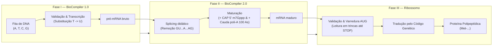

# Contrato da API Backend — Pipeline Ribossomo Protein Translator

**Versão da Documentação:** 1.0.0  
**Público-alvo:** Desenvolvedor(a) backend responsável pela implementação externa em Python (FastAPI).  
**Fonte Primária de Verdade (Normativa):**  
1. *BioCompiler 1.0 — DNA Transcriber — Especificação da Atividade* (`BioCompiler2.0/biocompiler/Especificações do BioCompiler 1.0 e slides.pdf`, seções 8, 9, 11 e 14; transcrição em `BioCompiler2.0/pdf_text_biocompiler1_v2.txt`), que substitui a versão/slide antigo.  
2. *BioCompiler 2.0 RNA Processor — Especificação da Atividade* (`BioCompiler2.0/pdf_text_biocompiler2.txt`)  
3. *Ribossomo Protein Translator — Especificação da Atividade* (`pdf_text.txt` / `4.4. Especificacao_Ribossomo_1_0_2026_2.pdf`)  
**Fontes Secundárias (Implementação de Referência e Tipagem Frontend):**  
- Tipos canônicos do frontend: `frontend/src/types/index.ts`  
- Cliente HTTP e contrato base FastAPI: `frontend/src/utils/apiClient.ts` e `frontend/src/components/ApiContractModal.tsx`  
- Motores locais de validação: `frontend/src/utils/dnaEngine.ts`, `frontend/src/utils/rnaEngine.ts`, `frontend/src/utils/translatorEngine.ts`, `frontend/src/utils/pipelineEngine.ts`  

---

## 1. Visão Geral da Pipeline Biológica

O produto educacional simula o fluxo completo da informação genética no dogma central da biologia molecular em organismos eucariotos. O sistema divide-se em três fases encadeadas, mais um modo unificado (*pipeline*):



### Representação Esquemática em Linha de Caracteres (ASCII)

```text
[DNA Bruto] 
   │
   ▼
[BioCompiler 1.0: Validação de bases, START (ATG), STOP em fase, Frameshift/Nonsense]
   │ (Sucesso)
   ▼
[pré-mRNA: fita contendo éxons e íntrons, T substituído por U]
   │
   ▼
[BioCompiler 2.0: Detecção de íntrons GU...A...AG, splicing, adição de m7Gppp e 100 As]
   │ (Sucesso)
   ▼
[mRNA Maduro: m7Gppp + éxons unidos + 100 As]
   │
   ▼
[Ribossomo 1.0: Validação m7Gppp e 100 As, busca do AUG, leitura em trincas até UAA/UAG/UGA]
   │ (Sucesso)
   ▼
[Proteína: Cadeia polipeptídica, ex.: Met-Ala-Lys-Pro]
```

---

## 2. Configurações Globais da API (FastAPI)

### 2.1 Informações de Conexão e CORS
- **Base URL:** `http://localhost:8000/api`
- **Porta padrão:** `8000`
- **Protocolo:** HTTP/1.1 ou HTTP/2
- **CORS (Cross-Origin Resource Sharing):** O backend DEVE permitir origens locais de desenvolvimento web do frontend (`http://localhost:5173` ou `*`), incluindo métodos `POST`, `OPTIONS`, `GET` e cabeçalhos `Content-Type`.

### 2.2 Tratamento de Erros e Códigos de Status HTTP

| Código HTTP | Significado Técnico | Quando Retornar |
|---|---|---|
| `200 OK` | Sucesso no processamento do lote | O lote foi recebido e analisado. **Atenção:** Mutações, erros biológicos, íntrons truncados ou códons ausentes NÃO são erros de transporte HTTP; são resultados de domínio e devem ser entregues no array `results` com status `200 OK`. |
| `422 Unprocessable Entity` | Erro de validação de payload JSON | O JSON enviado está malformado, o campo `sequences` não foi fornecido ou não é uma lista de strings (validação padrão do Pydantic). |
| `500 Internal Server Error` | Exceção não tratada no backend | Erro inesperado no runtime Python. Dispara o fallback automático do frontend. |

### 2.3 Processamento em Lote (Batch)
Todas as especificações (BioCompiler 1.0, BioCompiler 2.0 e Ribossomo 1.0) exigem o processamento em lote de arquivos com uma ou múltiplas linhas independentes. Consequentemente, **todos os endpoints recebem um array de strings `sequences`** e retornam uma lista correspondente de análises no array `results`, preservando rigorosamente a ordem original (1:1) com `entryNumber` iniciando em 1.

---

## 3. Especificação dos Endpoints

> ### Status de Implementação
>
> | Seção | Rota | Status | Observação |
> |---|---|---|---|
> | 3.1 | `POST /api/dna` | 📄 **ESPECIFICADO, não implementado** | Não existe no backend atual (`backend/app/main.py`). O frontend no modo `python_backend` executa sempre o motor local `dnaEngine.ts` para a Fase I, sem tentativa de rede e sem aviso de contingência. |
> | 3.2 | `POST /api/rna` | 📄 **ESPECIFICADO, não implementado** | Idem: sempre `rnaEngine.ts` local no modo `python_backend`. |
> | 3.3 | `POST /api/translate` | ✅ **IMPLEMENTADO** | Único endpoint real do backend Python hoje (Fase III). No modo `python_backend` o frontend tenta este endpoint e cai para `translatorEngine.ts` local, com aviso em tela, apenas em caso de falha de rede. |
> | 3.4 | `POST /api/pipeline` | 📄 **ESPECIFICADO, não implementado** | Idem: sempre `pipelineEngine.ts` local no modo `python_backend`. |
> | 3.5 | `/api/health`, `/api/translate/export`, `/api/translate/examples`, `/api/translate/genetic-code` | ✅ **IMPLEMENTADOS** | Endpoints auxiliares da Fase III, todos presentes em `backend/app/main.py` — ver seção 3.5. |
>
> As seções 3.1, 3.2 e 3.4 permanecem no contrato como especificação normativa para uma futura implementação backend das Fases I, II e Pipeline; até lá, refletem apenas o comportamento dos motores locais equivalentes.

### 3.1 Fase I — `POST /api/dna` (BioCompiler 1.0)

Recebe uma lista de fitas de DNA, valida o alfabeto canônico `{A, T, C, G}`, localiza a região codificante (START `ATG` até STOP em fase `TAA`/`TAG`/`TGA`), classifica a sequência e transcreve para pré-mRNA (`T` → `U`).

- **Método HTTP:** `POST`
- **Rota:** `/api/dna`
- **Content-Type:** `application/json`

#### Request Schema (`AnalyzeRequest`)
```json
{
  "sequences": ["string"]
}
```

#### Response Schema (`BackendDnaAnalyzeResponse`)
```json
{
  "results": [
    {
      "entryNumber": 1,
      "rawSequence": "ATGGCTAAACCGTAA",
      "cleanSequence": "ATGGCTAAACCGTAA",
      "status": "CORRETO",
      "dnaCase": "CORRETO",
      "resultLabel": "CORRETO",
      "detail": "CORRETO",
      "valid": true,
      "invalidBase": "",
      "invalidBasePosition": -1,
      "startValid": true,
      "startIndex": 0,
      "stopValid": true,
      "stopCodon": "TAA",
      "stopIndex": 12,
      "codonCount": 5,
      "cdsDna": "ATGGCTAAACCGTAA",
      "preMrna": "AUGGCUAAACCGUAA",
      "diagnosticSummary": "Sequência válida: START (ATG) e STOP (TAA) encontrados no mesmo quadro de leitura, com 5 códons.",
      "didacticExplanation": "A região codificadora foi delimitada corretamente entre o START e o STOP no mesmo quadro de leitura, permitindo a transcrição integral do gene em pré-mRNA (T substituído por U).",
      "biologicalContext": "Um gene íntegro, sem indels nem mutações nonsense, garante que a RNA polimerase produza um pré-mRNA fiel ao molde de DNA."
    }
  ]
}
```

#### Dicionário de Campos de `DnaAnalysis`

| Campo | Tipo | Descrição |
|---|---|---|
| `entryNumber` | `integer` | Índice ordinal da entrada no lote (base 1). |
| `rawSequence` | `string` | Linha de DNA exatamente como submetida pelo cliente. |
| `cleanSequence` | `string` | DNA após sanitização (maiúsculas, remoção de whitespaces/BOM). |
| `status` | `string` (enum) | Status oficial (seção 9 do PDF oficial): `"CORRETO"` ou `"ERRO"` (`"APROVADO"` e `"ALERTA"` não existem mais). |
| `dnaCase` | `string` (enum) | Identificador canônico do caso: `"CORRETO"`, `"BASE_INVALIDA"`, `"START_AUSENTE"`, `"STOP_AUSENTE"`, `"FRAMESHIFT"`, `"NONSENSE"`. |
| `resultLabel` | `string` (enum) | Texto exato da coluna "Resposta esperada" (seção 8 do PDF) e campo `TIPO` da saída em tela (seção 14): `"CORRETO"`, `"BUG - base inválida"`, `"BUG - START ausente"`, `"BUG - STOP ausente"`, `"BUG - frameshift"`, `"BUG - nonsense / STOP prematuro"`. |
| `detail` | `string` | Mantido por compatibilidade; possui exatamente o mesmo texto de `resultLabel`. |
| `valid` | `boolean` | `true` exclusivamente quando `status == "CORRETO"` (`dnaCase == "CORRETO"`). |
| `invalidBase` | `string` | Caractere espúrio detectado fora de `{A, T, C, G}`, ou `""` se ausente. |
| `invalidBasePosition` | `integer` | Posição humana (1-indexed) da base inválida, ou `-1` se não aplicável. |
| `startValid` | `boolean` | `true` se o códon `ATG` foi localizado na fita. |
| `startIndex` | `integer` | Índice (0-indexed) de início do `ATG` na `cleanSequence`, ou `-1`. |
| `stopValid` | `boolean` | `true` se um STOP canônico em fase foi localizado. |
| `stopCodon` | `string` | Trinca do STOP em fase (`"TAA"`, `"TAG"` ou `"TGA"`), ou `""`. |
| `stopIndex` | `integer` | Índice (0-indexed) de início do STOP na `cleanSequence`, ou `-1`. |
| `codonCount` | `integer` | Contagem de trincas do CDS (do START ao STOP inclusive), ou `0`. |
| `cdsDna` | `string` | Subsequência de DNA correspondente ao CDS delimitado, ou `""`. |
| `preMrna` | `string` | Transcrito de RNA resultante (`T` → `U`), ou literal `"NÃO GERADO"`. |
| `diagnosticSummary` | `string` | Resumo técnico objetivo do diagnóstico. |
| `didacticExplanation` | `string` | Explicação didática contextualizada da regra biológica. |
| `biologicalContext` | `string` | Impacto genético/celular da mutação ou da transcrição. |

---

### 3.2 Fase II — `POST /api/rna` (BioCompiler 2.0)

Recebe uma lista de sequências de pré-mRNA, detecta o padrão didático de íntron `GU ... A ... AG` (com branch point `A` a uma distância de 10 a 30 nucleotídeos antes do sítio `AG`), executa o splicing removendo o íntron e unindo os éxons adjacentes, adiciona a CAP 5' (`m7Gppp`) e a cauda poli-A (exatamente 100 adeninas `A`).

- **Método HTTP:** `POST`
- **Rota:** `/api/rna`
- **Content-Type:** `application/json`

#### Request Schema (`AnalyzeRequest`)
```json
{
  "sequences": ["string"]
}
```

#### Response Schema (`BackendRnaAnalyzeResponse`)
```json
{
  "results": [
    {
      "entryNumber": 1,
      "rawSequence": "UCUCCCGUCCCCCACCCCCCCCCCCCCCAGUCUCCC",
      "cleanSequence": "UCUCCCGUCCCCCACCCCCCCCCCCCCCAGUCUCCC",
      "status": "OK",
      "result": "CORRETO",
      "isOfficialDiagnostic": true,
      "valid": true,
      "site5Valid": true,
      "site3Valid": true,
      "branchPointValid": true,
      "splicingValid": true,
      "introns": [
        {
          "start": 6,
          "end": 30,
          "branchPos": 13,
          "branchDistance": 15,
          "sequence": "GUCCCCCACCCCCCCCCCCCCCAG"
        }
      ],
      "splicedSequence": "UCUCCCUCUCCC",
      "cap5Added": true,
      "polyATailLength": 100,
      "matureMrna": "m7GpppUCUCCCUCUCCCAAAAAAAAAAAAAAAAAAAAAAAAAAAAAAAAAAAAAAAAAAAAAAAAAAAAAAAAAAAAAAAAAAAAAAAAAAAAAAAAAAAAAAAAAAAAAAAAAAAA",
      "errorLocation": "Nenhum erro detectado",
      "errorSnippet": "Sequência processada com splicing bem-sucedido",
      "diagnosticSummary": "Splicing concluído: 1 íntron(s) removido(s). CAP 5' e cauda poli-A adicionadas.",
      "didacticExplanation": "O(s) íntron(s) no padrão GU ... A ... AG foram removidos e os éxons unidos; em seguida a CAP 5' (m7Gppp) e a cauda poli-A (100 adeninas) foram adicionadas, gerando o mRNA maduro.",
      "biologicalContext": "O splicing, a CAP 5' e a cauda poli-A são etapas essenciais do processamento do pré-mRNA em eucariotos, garantindo estabilidade e reconhecimento pelo ribossomo."
    }
  ]
}
```

#### Dicionário de Campos de `RnaAnalysis`

| Campo | Tipo | Descrição |
|---|---|---|
| `entryNumber` | `integer` | Índice ordinal da entrada no lote (base 1). |
| `rawSequence` | `string` | Entrada bruta de pré-mRNA. |
| `cleanSequence` | `string` | Pré-mRNA sanitizado (maiúsculas, sem whitespaces). |
| `status` | `string` (enum) | Status binário: `"OK"` ou `"ERRO"`. |
| `result` | `string` (enum) | Diagnóstico oficial do PDF (seção 8): `"CORRETO"`, `"BUG - sítio 5' ausente"`, `"BUG - sítio 3' ausente"`, `"BUG - branch point"`. Para caracteres fora de `{A,U,C,G}`, a guarda defensiva retorna `"ENTRADA INVÁLIDA (guarda defensiva)"`. |
| `isOfficialDiagnostic` | `boolean` | `true` para os 4 diagnósticos oficiais do PDF; `false` se disparada a guarda defensiva de base inválida. |
| `valid` | `boolean` | `true` exclusivamente quando `status == "OK"` (`result == "CORRETO"`). |
| `site5Valid` | `boolean` | `true` se sítio 5' `GU` funcional foi detectado. |
| `site3Valid` | `boolean` | `true` se sítio 3' `AG` funcional foi detectado. |
| `branchPointValid` | `boolean` | `true` se adenina `A` entre 10 e 30 nt antes do `AG` foi validada. |
| `splicingValid` | `boolean` | `true` se a excisão do íntron e ligadura dos éxons ocorreram. |
| `introns` | `array[object]` | Lista de detalhes de cada íntron removido (ver `RnaIntronDetail` abaixo). |
| `splicedSequence` | `string` | Sequência após splicing dos éxons (sem CAP 5' e sem poli-A). |
| `cap5Added` | `boolean` | `true` se a tag computacional `m7Gppp` foi adicionada na extremidade 5'. |
| `polyATailLength` | `integer` | Comprimento da cauda adicionada (`100` em caso de sucesso; `0` se erro). |
| `matureMrna` | `string` | Sequência madura completa (`m7Gppp` + éxons + 100 As) ou `"NÃO GERADO"`. |
| `errorLocation` | `string` | Apontamento textual da coordenada da anomalia. |
| `errorSnippet` | `string` | Recorte da sequência destacando o ponto da falha entre colchetes. |
| `diagnosticSummary` | `string` | Síntese diagnóstica em linguagem técnica clara. |
| `didacticExplanation` | `string` | Racional didático da etapa molecular simulada. |
| `biologicalContext` | `string` | Fundamentação biológica da maturação do RNA. |

##### Sub-objeto `RnaIntronDetail`
- `start` (`integer`): Posição inicial (0-indexed) do `G` de `GU`.
- `end` (`integer`): Posição final (0-indexed, exclusiva) logo após o `G` de `AG`.
- `branchPos` (`integer`): Posição (0-indexed) da adenina do branch point escolhida.
- `branchDistance` (`integer`): Distância em nucleotídeos entre o branch point e o sítio terminal (`agPos - branchPos`).
- `sequence` (`string`): Trecho literal excisado do íntron (`GU...A...AG`).

---

### 3.3 Fase III — `POST /api/translate` (Ribossomo)

Recebe uma lista de mRNAs maduros com extremidades `m7Gppp` e cauda poli-A de exatamente 100 adeninas, valida as extremidades, localiza o códon `AUG`, traduz a fita em trincas conforme o código genético universal até o primeiro STOP em fase (`UAA`, `UAG`, `UGA`), sintetizando a proteína polipeptídica.

- **Método HTTP:** `POST`
- **Rota:** `/api/translate`
- **Content-Type:** `application/json`

#### Request Schema (`AnalyzeRequest`)
```json
{
  "sequences": ["string"]
}
```

#### Response Schema (`BackendAnalyzeResponse` / `AnalyzeResponse` no FastAPI)
```json
{
  "results": [
    {
      "entryNumber": 1,
      "rawSequence": "m7GpppCCAUGGCUAAACCGUAAGGAAAAAAAAAAAAAAAAAAAAAAAAAAAAAAAAAAAAAAAAAAAAAAAAAAAAAAAAAAAAAAAAAAAAAAAAAAAAAAAAAAAAAAAAAAAAAAAAAAAA",
      "status": "OK",
      "result": "CORRETO",
      "protein": "Met-Ala-Lys-Pro",
      "aminoAcids": ["Met", "Ala", "Lys", "Pro"],
      "cap5Valid": true,
      "cap5Found": "m7Gppp",
      "startValid": true,
      "startCodon": "AUG",
      "startIndex": 2,
      "readingFrameValid": true,
      "stopValid": true,
      "stopCodon": "UAA",
      "stopIndex": 14,
      "polyAValid": true,
      "polyALength": 100,
      "translationValid": true,
      "utr5": "CC",
      "codingRna": "AUGGCUAAACCGUAA",
      "utr3": "GG",
      "polyATail": "AAAAAAAAAAAAAAAAAAAAAAAAAAAAAAAAAAAAAAAAAAAAAAAAAAAAAAAAAAAAAAAAAAAAAAAAAAAAAAAAAAAAAAAAAAAAAAAAAAAA",
      "codons": [
        {
          "codon": "AUG",
          "aminoAcid": "Met",
          "name": "Metionina",
          "fullSeqPos": 2,
          "inFrame": true,
          "type": "start",
          "color": "#10b981"
        },
        {
          "codon": "GCU",
          "aminoAcid": "Ala",
          "name": "Alanina",
          "fullSeqPos": 5,
          "inFrame": true,
          "type": "sense",
          "color": "#3b82f6"
        },
        {
          "codon": "AAA",
          "aminoAcid": "Lys",
          "name": "Lisina",
          "fullSeqPos": 8,
          "inFrame": true,
          "type": "sense",
          "color": "#8b5cf6"
        },
        {
          "codon": "CCG",
          "aminoAcid": "Pro",
          "name": "Prolina",
          "fullSeqPos": 11,
          "inFrame": true,
          "type": "sense",
          "color": "#f97316"
        },
        {
          "codon": "UAA",
          "aminoAcid": "STOP",
          "name": "Códon de Término",
          "fullSeqPos": 14,
          "inFrame": true,
          "type": "stop",
          "color": "#f43f5e"
        }
      ],
      "diagnosticSummary": "Tradução concluída com sucesso! Proteína gerada com 4 aminoácidos (Met-Ala-Lys-Pro).",
      "didacticExplanation": "O ribossomo identificou a 5' UTR (2 nt), iniciou no códon AUG (AUG), leu 4 trincas em fase, encontrou o sinal de parada UAA e finalizou na 3' UTR antes da cauda poli-A.",
      "biologicalContext": "Expressão gênica perfeita: a proteína funcional foi sintetizada sem anomalias conformacionais ou mutações deletérias."
    }
  ]
}
```

#### Dicionário de Campos de `RibosomeAnalysis`

| Campo | Tipo | Descrição |
|---|---|---|
| `entryNumber` | `integer` | Índice da sequência no lote (base 1). |
| `rawSequence` | `string` | Sequência original de mRNA maduro submetida. |
| `status` | `string` (enum) | `"OK"` ou `"ERRO"`. |
| `result` | `string` (enum) | Diagnóstico literal do PDF (seção 8): `"CORRETO"`, `"BUG - CAP 5'"`, `"BUG - START ausente"`, `"BUG - STOP ausente"`, `"BUG - quadro de leitura"`, `"BUG - cauda poli -A"`. (Nota normativa: espaço antes do `-A`). |
| `protein` | `string` | Cadeia polipeptídica formatada com hifens (ex.: `"Met-Ala-Lys-Pro"`) ou o literal `"NÃO GERADA"`. |
| `aminoAcids` | `array[string]` | Lista ordenada de siglas de 3 letras dos aminoácidos traduzidos (sem o STOP). |
| `cap5Valid` | `boolean` | `true` se a fita inicia com o marcador literal `m7Gppp`. |
| `cap5Found` | `string` | Marcador detectado no início da sequência. |
| `startValid` | `boolean` | `true` se o códon `AUG` foi encontrado no corpo intermediário do mRNA. |
| `startCodon` | `string` | `"AUG"` quando válido, ou `""`. |
| `startIndex` | `integer` | Posição (0-indexed) do `AUG` na fita após o corte do `m7Gppp`. |
| `readingFrameValid` | `boolean` | `true` se as trincas foram lidas em fase até um STOP canônico. |
| `stopValid` | `boolean` | `true` se um STOP em fase (`UAA`, `UAG` ou `UGA`) encerrou a leitura. |
| `stopCodon` | `string` | Trinca terminal do STOP (`"UAA"`, `"UAG"`, `"UGA"` ou `""`). |
| `stopIndex` | `integer` | Posição (0-indexed) de início do STOP após a CAP. |
| `polyAValid` | `boolean` | `true` se a extremidade 3' termina com exatamente 100 adeninas. |
| `polyALength` | `integer` | Contagem consecutiva de adeninas no sufixo 3'. |
| `translationValid` | `boolean` | `true` se a síntese proteica gerou polipeptídeo válido. |
| `utr5` | `string` | Região 5' não traduzida (entre a CAP e o primeiro `AUG`). |
| `codingRna` | `string` | Região codificante traduzida (`AUG` até o STOP inclusive). |
| `utr3` | `string` | Região 3' não traduzida (entre o STOP e o início da cauda poli-A). |
| `polyATail` | `string` | Trecho de adeninas consecutivas detectado na cauda. |
| `codons` | `array[object]` | Detalhamento de cada trinca lida (ver `CodonDetail` abaixo). |
| `diagnosticSummary` | `string` | Resumo técnico da avaliação do ribossomo. |
| `didacticExplanation` | `string` | Explicação dos passos de reconhecimento molecular. |
| `biologicalContext` | `string` | Repercussão celular da síntese ou do aborto traducional. |

##### Sub-objeto `CodonDetail`
- `codon` (`string`): Trinca lida (ex.: `"AUG"`, `"GCU"`, `"UAA"`).
- `aminoAcid` (`string`): Código de 3 letras do aminoácido (ex.: `"Met"`, `"Ala"`, `"STOP"`).
- `name` (`string`): Nome do aminoácido em português (ex.: `"Metionina"`, `"Término"`).
- `fullSeqPos` (`integer`): Posição de início da trinca em relação à fita interna de RNA.
- `inFrame` (`boolean`): Se a trinca pertence à fase de leitura válida.
- `type` (`string`): `"start"`, `"sense"` ou `"stop"`.
- `color` (`string`): Código hexadecimal para destaque visual na interface.

---

### 3.4 Modo Pipeline Completo — `POST /api/pipeline`

Encadeia sequencialmente as 3 fases moleculares a partir de fitas de DNA bruto. Executa a Fase I; se aprovada, envia o `preMrna` gerado para a Fase II; se o splicing for bem-sucedido, submete o `matureMrna` para a Fase III. Caso ocorra erro em qualquer etapa, a execução da respectiva linha é interrompida naquele ponto, preservando os detalhes do estágio que falhou.

- **Método HTTP:** `POST`
- **Rota:** `/api/pipeline`
- **Content-Type:** `application/json`

#### Request Schema (`AnalyzeRequest`)
```json
{
  "sequences": ["string"]
}
```

#### Response Schema (`BackendPipelineAnalyzeResponse`)
```json
{
  "results": [
    {
      "entryNumber": 1,
      "rawSequence": "ATGGCTAAACCGTAA",
      "dna": { "..." : "Objeto DnaAnalysis completo da Fase I" },
      "rna": { "..." : "Objeto RnaAnalysis completo da Fase II, ou null se Fase I falhou" },
      "ribosome": { "..." : "Objeto RibosomeAnalysis completo da Fase III, ou null se Fase I ou II falhou" },
      "success": true,
      "stoppedAtPhase": null,
      "stopReason": ""
    }
  ]
}
```

#### Dicionário de Campos de `PipelineAnalysis`

| Campo | Tipo | Descrição |
|---|---|---|
| `entryNumber` | `integer` | Índice da entrada no lote (base 1). |
| `rawSequence` | `string` | Sequência original de DNA de entrada. |
| `dna` | `DnaAnalysis` | Resultado completo da análise de DNA da Fase I. |
| `rna` | `RnaAnalysis` \| `null` | Resultado da Fase II (ou `null` se a Fase I falhou). |
| `ribosome` | `RibosomeAnalysis` \| `null` | Resultado da Fase III (ou `null` se Fase I ou II falharam). |
| `success` | `boolean` | `true` somente se as 3 fases concluíram com sucesso (`dna.valid && rna.valid && ribosome.status == 'OK'`). |
| `stoppedAtPhase` | `string` \| `null` | Fase em que o processamento parou: `"dna"`, `"rna"`, `"ribosome"` ou `null` se completou. |
| `stopReason` | `string` | Explicação textual da causa da parada, ou `""` se `success == true`. |

---

### 3.5 Endpoints Auxiliares Implementados

Além de `POST /api/translate` (seção 3.3), o backend atual expõe quatro rotas auxiliares, todas em `backend/app/main.py`. Nenhuma recebe `sequences`; todas respondem a `GET` (exceto o export), sem necessidade de payload.

| Método | Rota | Descrição |
|---|---|---|
| `GET` | `/api/health` | Healthcheck simples, usado pelo indicador "Backend: online/offline" do Header. |
| `POST` | `/api/translate/export` | Gera o arquivo de exportação da Fase III no formato oficial CSV (ver seção 7.3), a partir do mesmo `AnalyzeRequest` de `/api/translate`. |
| `GET` | `/api/translate/examples` | Retorna os 6 casos oficiais da seção 14 da especificação do Ribossomo. |
| `GET` | `/api/translate/genetic-code` | Retorna o código genético completo, os STOPs canônicos e os metadados de aminoácidos usados na customização visual do frontend. |

#### `GET /api/health` — Response Schema (`HealthResponse`)
```json
{
  "status": "ok",
  "service": "ribossomo-protein-translator",
  "version": "1.0.0"
}
```

#### `POST /api/translate/export` — Resposta
Corpo em texto puro (`Content-Type: text/csv; charset=utf-8`), sem envelope JSON — cabeçalho `linha;status;resultado;proteina` seguido de uma linha por sequência, no formato exato da seção 11/14 da especificação do Ribossomo (ver seção 7.3 deste contrato).

#### `GET /api/translate/examples` — Response Schema
```json
{
  "examples": [
    {
      "id": 1,
      "name": "14.1 CORRETO",
      "expectedResult": "CORRETO",
      "expectedProtein": "Met-Ala-Lys-Pro",
      "sequence": "m7GpppCCAUGGCUAAACCGUAAGG...AAA"
    }
  ]
}
```
Um objeto por caso oficial (6 no total), na ordem da seção 14 da especificação.

#### `GET /api/translate/genetic-code` — Response Schema (`GeneticCodeResponse`)
```json
{
  "geneticCode": { "AUG": "Met", "UAA": "STOP", "...": "..." },
  "aminoAcids": {
    "Met": { "code3": "Met", "code1": "M", "namePt": "Metionina", "nameEn": "Methionine", "property": "special", "color": "#10b981" },
    "...": { "...": "..." }
  },
  "stopCodons": ["UAA", "UAG", "UGA"]
}
```
- `geneticCode`: mapa `codon -> sigla do aminoácido` (64 entradas).
- `aminoAcids`: mapa `sigla -> metadados` (nome em português/inglês, propriedade físico-química, cor hexadecimal).
- `stopCodons`: lista ordenada dos 3 códons de parada.

---

## 4. Tabelas Consolidadas de Diagnósticos por Fase

As tabelas a seguir estabelecem as strings literais normativas extraídas diretamente das especificações em PDF, as condições que as disparam e a ordem de precedência rigorosa de avaliação que o backend deve implementar.

### 4.1 Fase I — BioCompiler 1.0 (DNA Transcriber)

> **Regra Normativa (PDF seções 8, 9, 11 e 14):** Fonte primária oficial: *"BioCompiler2.0/biocompiler/Especificações do BioCompiler 1.0 e slides.pdf"*. O campo `status` é estritamente binário (`CORRETO` ou `ERRO`), extinguindo os antigos rótulos `APROVADO` e `ALERTA`. O campo `valid` é `true` exclusivamente quando `status == "CORRETO"`. O campo `resultLabel` (e seu alias `detail`) reproduz a string literal exata da coluna "Resposta esperada" da Seção 8 do PDF oficial.

| Precedência | Status Oficial | Resposta Esperada (`resultLabel` / `detail`) | Condição Disparadora Precisa |
|:---:|:---:|---|---|
| **1** | `ERRO` | `BUG - base inválida` | Presença de pelo menos um caractere não pertencente ao alfabeto canônico `{A, T, C, G}` na sequência higienizada. Verificada antes de qualquer busca de códons. |
| **2** | `ERRO` | `BUG - START ausente` | Sequência não contém nenhuma ocorrência da substring `ATG`. Não há como iniciar a transcrição da CDS. |
| **3** | `ERRO` | `BUG - nonsense / STOP prematuro` | A partir do primeiro `ATG`, existem **dois ou mais** códons STOP (`TAA`, `TAG` ou `TGA`) no mesmo quadro de leitura. O primeiro STOP interrompe a fita antes do término esperado da região codificante, restando sequência após ele. |
| **4** | `CORRETO` | `CORRETO` | Existe o primeiro `ATG` e **exatamente um** STOP canônico em fase até o fim da CDS. Transcreve DNA → pré-mRNA (`T` → `U`). |
| **5** | `ERRO` | `BUG - frameshift` | Nenhum STOP em fase foi encontrado **e** o trecho restante a partir do `ATG` até o fim da sequência não é múltiplo de 3 (`(len - start_pos) % 3 != 0`), rompendo a organização em trincas segundo a convenção didática. |
| **6** | `ERRO` | `BUG - STOP ausente` | Nenhum STOP em fase foi encontrado **e** o trecho restante a partir do `ATG` fecha em trincas completas (`(len - start_pos) % 3 == 0`), mas nenhuma delas é STOP. |

#### 4.1.1 Saída Padrão para Tela / Terminal (PDF Seções 9 e 14)

Conforme as seções 9 e 14 da especificação oficial, a saída exibida na tela do terminal segue uma estrutura visual padronizada:
1. **Banner Inicial:** Exibido uma única vez no topo do processamento em lote, composto por 40 caracteres de igual (`=`), o título `BIOCOMPILER 1.0 - DNA TRANSCRIBER` e mais 40 caracteres de igual (`=`).
2. **Bloco por Entrada:**
   - **Caso Válido (`STATUS: CORRETO`):** Exibe as linhas `ENTRADA: <n>`, `STATUS: CORRETO`, `Bases: OK`, `START: ATG - OK`, `Quadro de leitura: OK`, `STOP: <códon> - OK` (indicando o códon de parada encontrado, ex.: `TAA`), `Transcrição: OK` e `pré-mRNA: <sequência transcrita>`.
   - **Caso de Erro (`STATUS: ERRO`):** Exibe as linhas `ENTRADA: <n>`, `STATUS: ERRO`, `TIPO: <resultLabel>` (com a resposta esperada exata, ex.: `TIPO: BUG - base inválida`) e `pré-mRNA: NÃO GERADO`.
3. **Delimitador de Bloco:** Cada entrada é finalizada por uma linha com exatamente 40 hífens (`----------------------------------------`).

##### Exemplo Completo das 6 Entradas da Seção 14 do PDF Oficial

Considerando o arquivo de entrada com as 6 sequências canônicas da Seção 14 do PDF:
1. Linha 1: `ATGGCTAAACCGTAA` (Caso 1 — Entrada correta)
2. Linha 2: `ATGGCTXAACCGTAA` (Caso 2 — Base inválida)
3. Linha 3: `CCCGCTAAACCGTAA` (Caso 3 — START ausente)
4. Linha 4: `ATGGCTAAACCGGGC` (Caso 4 — STOP ausente)
5. Linha 5: `ATGGCTAAAACCGTAA` (Caso 5 — Frameshift)
6. Linha 6: `ATGGCTTAACCGGGCTAA` (Caso 6 — Nonsense / STOP prematuro)

A saída no terminal gerada pelo processamento desse lote é:

```text
========================================
BIOCOMPILER 1.0 - DNA TRANSCRIBER
========================================
ENTRADA: 1
STATUS: CORRETO
Bases: OK
START: ATG - OK
Quadro de leitura: OK
STOP: TAA - OK
Transcrição: OK
pré-mRNA: AUGGCUAAACCGUAA
----------------------------------------
ENTRADA: 2
STATUS: ERRO
TIPO: BUG - base inválida
pré-mRNA: NÃO GERADO
----------------------------------------
ENTRADA: 3
STATUS: ERRO
TIPO: BUG - START ausente
pré-mRNA: NÃO GERADO
----------------------------------------
ENTRADA: 4
STATUS: ERRO
TIPO: BUG - STOP ausente
pré-mRNA: NÃO GERADO
----------------------------------------
ENTRADA: 5
STATUS: ERRO
TIPO: BUG - frameshift
pré-mRNA: NÃO GERADO
----------------------------------------
ENTRADA: 6
STATUS: ERRO
TIPO: BUG - nonsense / STOP prematuro
pré-mRNA: NÃO GERADO
----------------------------------------
```

---

### 4.2 Fase II — BioCompiler 2.0 (RNA Processor)

> **Regra Normativa (PDF pág. 2, seção 8):** O PDF define exatamente 4 casos oficiais de saída (`CORRETO`, `BUG - sítio 5' ausente`, `BUG - sítio 3' ausente`, `BUG - branch point`).
> 
> *Nota sobre Guarda de Entrada:* O código legado continha uma verificação de base inválida. Na especificação normativa, esse caso NÃO é um diagnóstico oficial da tabela 8, devendo ser tratado estritamente como guarda defensiva de validação com `isOfficialDiagnostic = false` e `result = "ENTRADA INVÁLIDA (guarda defensiva)"`.

| Precedência | Status Oficial | Diagnóstico Literal (PDF) | Condição Disparadora Precisa |
|:---:|:---:|---|---|
| *Guarda* | `ERRO` | `ENTRADA INVÁLIDA (guarda defensiva)` | *(Guarda não-oficial)* Caractere fora de `{A, U, C, G}`. Rejeita entrada antes do parser molecular. |
| **1** | `ERRO` | `BUG - sítio 5' ausente` | Não existe nenhum `GU` na sequência; OU existem `GU` e `AG`, mas nenhum par compatível (`ag_pos > gu_pos + 2`) e o primeiro `AG` ocorre antes do primeiro `GU`. |
| **2** | `ERRO` | `BUG - sítio 3' ausente` | Existe ao menos um `GU`, mas nenhum `AG`; OU existem `GU` e `AG` mas nenhum par compatível, e o primeiro `GU` ocorre antes do primeiro `AG`. |
| **3** | `ERRO` | `BUG - branch point` | Existe ao menos um par compatível `(GU, AG)`, mas **nenhuma** adenina (`A`) é encontrada na janela de branch point entre 10 e 30 nucleotídeos antes do início do `AG` (`ag_pos - 30 <= branch_pos <= ag_pos - 10`). |
| **4** | `OK` | `CORRETO` | Identificado íntron no padrão `GU ... A ... AG` com branch point válido na janela [10, 30]. Excisão dos íntrons, união dos éxons, prefixo `m7Gppp` e sufixo de 100 adeninas `A`. |

---

### 4.3 Fase III — Ribossomo 1.0 (Protein Translator)

> **Regra Normativa (PDF pág. 4, seção 8):** O PDF lista exatamente 6 casos diagnósticos. A acentuação e a grafia devem ser reproduzidas literalmente, incluindo o espaço na cauda poli-A: `"BUG - cauda poli -A"`.

| Precedência | Status Oficial | Resposta Esperada Literal (PDF) | Condição Disparadora Precisa |
|:---:|:---:|---|---|
| **1** | `ERRO` | `BUG - CAP 5'` | A sequência não se inicia com o marcador literal `m7Gppp`. O ribossomo não reconhece o início do transcrito. |
| **2** | `ERRO` | `BUG - cauda poli -A` | A extremidade 3' não apresenta exatamente 100 adeninas consecutivas (ex.: cauda ausente, com menos de 100 As ou com bases não-A intercaladas no fim), **EXCETO** quando o excedente de 1 ou 2 A's pertence a um STOP `UAA` ou `UGA` em fase imediatamente adjacente, caso em que a cauda é tratada como válida (100 As). |
| **3** | `ERRO` | `BUG - START ausente` | Entre a CAP 5' e a cauda poli-A de 100 As, não existe o códon de iniciação `AUG`. |
| **4** | `ERRO` | `BUG - STOP ausente` | Existe códon `AUG`, mas nenhum STOP canônico em fase (`UAA`, `UAG`, `UGA`) é localizado **e** o comprimento total a partir do `AUG` até o fim da sequência (incluindo a cauda poli-A) fecha em trincas completas (`(len(afterCap) - augPos) % 3 == 0`). |
| **5** | `ERRO` | `BUG - quadro de leitura` | Existe códon `AUG`, mas nenhum STOP canônico em fase é localizado **e** o comprimento total a partir do `AUG` até o fim da sequência (incluindo a cauda poli-A) não fecha em trincas completas (`(len(afterCap) - augPos) % 3 != 0`), caracterizando mutação frameshift. |
| **6** | `OK` | `CORRETO` | Transcrito com `m7Gppp`, cauda de 100 As, `AUG` inicial e STOP canônico em fase (`UAA`, `UAG` ou `UGA`). Tradução dos códons em aminoácidos até o STOP. |

---

## 5. Exemplos de Requisição e Resposta JSON

### 5.1 Fase I — DNA (`POST /api/dna`)

#### Exemplo 1: Sucesso (`CORRETO`)
**Request:**
```json
{
  "sequences": [
    "ATGGCTAAACCGTAA"
  ]
}
```

**Response (HTTP 200):**
```json
{
  "results": [
    {
      "entryNumber": 1,
      "rawSequence": "ATGGCTAAACCGTAA",
      "cleanSequence": "ATGGCTAAACCGTAA",
      "status": "CORRETO",
      "dnaCase": "CORRETO",
      "resultLabel": "CORRETO",
      "detail": "CORRETO",
      "valid": true,
      "invalidBase": "",
      "invalidBasePosition": -1,
      "startValid": true,
      "startIndex": 0,
      "stopValid": true,
      "stopCodon": "TAA",
      "stopIndex": 12,
      "codonCount": 5,
      "cdsDna": "ATGGCTAAACCGTAA",
      "preMrna": "AUGGCUAAACCGUAA",
      "diagnosticSummary": "Sequência válida: START (ATG) e STOP (TAA) encontrados no mesmo quadro de leitura, com 5 códons.",
      "didacticExplanation": "A região codificadora foi delimitada corretamente entre o START e o STOP no mesmo quadro de leitura, permitindo a transcrição integral do gene em pré-mRNA (T substituído por U).",
      "biologicalContext": "Um gene íntegro, sem indels nem mutações nonsense, garante que a RNA polimerase produza um pré-mRNA fiel ao molde de DNA."
    }
  ]
}
```

#### Exemplo 2: Erro (`BASE_INVALIDA` / `ERRO`)
**Request:**
```json
{
  "sequences": [
    "ATGGCTXAACCGTAA"
  ]
}
```

**Response (HTTP 200):**
```json
{
  "results": [
    {
      "entryNumber": 1,
      "rawSequence": "ATGGCTXAACCGTAA",
      "cleanSequence": "ATGGCTXAACCGTAA",
      "status": "ERRO",
      "dnaCase": "BASE_INVALIDA",
      "resultLabel": "BUG - base inválida",
      "detail": "BUG - base inválida",
      "valid": false,
      "invalidBase": "X",
      "invalidBasePosition": 7,
      "startValid": false,
      "startIndex": -1,
      "stopValid": false,
      "stopCodon": "",
      "stopIndex": -1,
      "codonCount": 0,
      "cdsDna": "",
      "preMrna": "NÃO GERADO",
      "diagnosticSummary": "Caractere inválido encontrado na posição 7: 'X'.",
      "didacticExplanation": "O DNA é composto exclusivamente pelas bases nitrogenadas Adenina (A), Timina (T), Citosina (C) e Guanina (G). Qualquer outro caractere invalida a sequência como material genético.",
      "biologicalContext": "Uma base fora do alfabeto canônico impede qualquer leitura biológica confiável da fita."
    }
  ]
}
```

---

### 5.2 Fase II — RNA (`POST /api/rna`)

#### Exemplo 1: Sucesso (`CORRETO`)
*(Entrada modelo: éxon `UCUCCC` + íntron `GUCCCCCACCCCCCCCCCCCCCAG` + éxon `UCUCCC`)*
**Request:**
```json
{
  "sequences": [
    "UCUCCCGUCCCCCACCCCCCCCCCCCCCAGUCUCCC"
  ]
}
```

**Response (HTTP 200):**
```json
{
  "results": [
    {
      "entryNumber": 1,
      "rawSequence": "UCUCCCGUCCCCCACCCCCCCCCCCCCCAGUCUCCC",
      "cleanSequence": "UCUCCCGUCCCCCACCCCCCCCCCCCCCAGUCUCCC",
      "status": "OK",
      "result": "CORRETO",
      "isOfficialDiagnostic": true,
      "valid": true,
      "site5Valid": true,
      "site3Valid": true,
      "branchPointValid": true,
      "splicingValid": true,
      "introns": [
        {
          "start": 6,
          "end": 30,
          "branchPos": 13,
          "branchDistance": 15,
          "sequence": "GUCCCCCACCCCCCCCCCCCCCAG"
        }
      ],
      "splicedSequence": "UCUCCCUCUCCC",
      "cap5Added": true,
      "polyATailLength": 100,
      "matureMrna": "m7GpppUCUCCCUCUCCCAAAAAAAAAAAAAAAAAAAAAAAAAAAAAAAAAAAAAAAAAAAAAAAAAAAAAAAAAAAAAAAAAAAAAAAAAAAAAAAAAAAAAAAAAAAAAAAAAAAA",
      "errorLocation": "Nenhum erro detectado",
      "errorSnippet": "Sequência processada com splicing bem-sucedido",
      "diagnosticSummary": "Splicing concluído: 1 íntron(s) removido(s). CAP 5' e cauda poli-A adicionadas.",
      "didacticExplanation": "O(s) íntron(s) no padrão GU ... A ... AG foram removidos e os éxons unidos; em seguida a CAP 5' (m7Gppp) e a cauda poli-A (100 adeninas) foram adicionadas, gerando o mRNA maduro.",
      "biologicalContext": "O splicing, a CAP 5' e a cauda poli-A são etapas essenciais do processamento do pré-mRNA em eucariotos, garantindo estabilidade e reconhecimento pelo ribossomo."
    }
  ]
}
```

#### Exemplo 2: Erro (`BUG - branch point`)
*(Intron GU...AG sem nenhuma adenina a 10-30 nt do AG)*
**Request:**
```json
{
  "sequences": [
    "UCUCCCGUCCCCCCCCCCCCCCCCCCCCAGUCUCCC"
  ]
}
```

**Response (HTTP 200):**
```json
{
  "results": [
    {
      "entryNumber": 1,
      "rawSequence": "UCUCCCGUCCCCCCCCCCCCCCCCCCCCAGUCUCCC",
      "cleanSequence": "UCUCCCGUCCCCCCCCCCCCCCCCCCCCAGUCUCCC",
      "status": "ERRO",
      "result": "BUG - branch point",
      "isOfficialDiagnostic": true,
      "valid": false,
      "site5Valid": true,
      "site3Valid": true,
      "branchPointValid": false,
      "splicingValid": false,
      "introns": [],
      "splicedSequence": "",
      "cap5Added": false,
      "polyATailLength": 0,
      "matureMrna": "NÃO GERADO",
      "errorLocation": "Entre GU na posição 7 e AG na posição 29",
      "errorSnippet": "UCUCCC[GUCCCCCCCCCCCCCCCCCCCCAG]UCUCCC",
      "diagnosticSummary": "Não há adenina (branch point) entre 10 e 30 nucleotídeos antes do AG terminal do íntron.",
      "didacticExplanation": "A convenção didática do BioCompiler 2.0 exige um íntron completo no padrão GU ... A ... AG, com o branch point A entre 10 e 30 nt antes do AG terminal, para que o splicing seja realizado.",
      "biologicalContext": "Sem os sinais de splicing corretos, o spliceossomo não consegue reconhecer e remover o íntron, impedindo a maturação do mRNA."
    }
  ]
}
```

---

### 5.3 Fase III — Ribossomo (`POST /api/translate`)

#### Exemplo 1: Sucesso (`CORRETO`)
**Request:**
```json
{
  "sequences": [
    "m7GpppCCAUGGCUAAACCGUAAGGAAAAAAAAAAAAAAAAAAAAAAAAAAAAAAAAAAAAAAAAAAAAAAAAAAAAAAAAAAAAAAAAAAAAAAAAAAAAAAAAAAAAAAAAAAAAAAAAAAAA"
  ]
}
```

**Response (HTTP 200):**
```json
{
  "results": [
    {
      "entryNumber": 1,
      "rawSequence": "m7GpppCCAUGGCUAAACCGUAAGGAAAAAAAAAAAAAAAAAAAAAAAAAAAAAAAAAAAAAAAAAAAAAAAAAAAAAAAAAAAAAAAAAAAAAAAAAAAAAAAAAAAAAAAAAAAAAAAAAAAA",
      "status": "OK",
      "result": "CORRETO",
      "protein": "Met-Ala-Lys-Pro",
      "aminoAcids": ["Met", "Ala", "Lys", "Pro"],
      "cap5Valid": true,
      "cap5Found": "m7Gppp",
      "startValid": true,
      "startCodon": "AUG",
      "startIndex": 2,
      "readingFrameValid": true,
      "stopValid": true,
      "stopCodon": "UAA",
      "stopIndex": 14,
      "polyAValid": true,
      "polyALength": 100,
      "translationValid": true,
      "utr5": "CC",
      "codingRna": "AUGGCUAAACCGUAA",
      "utr3": "GG",
      "polyATail": "AAAAAAAAAAAAAAAAAAAAAAAAAAAAAAAAAAAAAAAAAAAAAAAAAAAAAAAAAAAAAAAAAAAAAAAAAAAAAAAAAAAAAAAAAAAAAAAAAAAA",
      "codons": [
        {
          "codon": "AUG",
          "aminoAcid": "Met",
          "name": "Metionina",
          "fullSeqPos": 2,
          "inFrame": true,
          "type": "start",
          "color": "#10b981"
        },
        {
          "codon": "GCU",
          "aminoAcid": "Ala",
          "name": "Alanina",
          "fullSeqPos": 5,
          "inFrame": true,
          "type": "sense",
          "color": "#3b82f6"
        },
        {
          "codon": "AAA",
          "aminoAcid": "Lys",
          "name": "Lisina",
          "fullSeqPos": 8,
          "inFrame": true,
          "type": "sense",
          "color": "#8b5cf6"
        },
        {
          "codon": "CCG",
          "aminoAcid": "Pro",
          "name": "Prolina",
          "fullSeqPos": 11,
          "inFrame": true,
          "type": "sense",
          "color": "#f97316"
        },
        {
          "codon": "UAA",
          "aminoAcid": "STOP",
          "name": "Códon de Término",
          "fullSeqPos": 14,
          "inFrame": true,
          "type": "stop",
          "color": "#f43f5e"
        }
      ],
      "diagnosticSummary": "Tradução concluída com sucesso! Proteína gerada com 4 aminoácidos (Met-Ala-Lys-Pro).",
      "didacticExplanation": "O ribossomo identificou a 5' UTR (2 nt), iniciou no códon AUG (AUG), leu 4 trincas em fase, encontrou o sinal de parada UAA e finalizou na 3' UTR antes da cauda poli-A.",
      "biologicalContext": "Expressão gênica perfeita: a proteína funcional foi sintetizada sem anomalias conformacionais ou mutações deletérias."
    }
  ]
}
```

#### Exemplo 2: Erro (`BUG - CAP 5'`)
*(Entrada sem prefixo m7Gppp)*
**Request:**
```json
{
  "sequences": [
    "CCAUGGCUAAACCGUAAGGAAAAAAAAAAAAAAAAAAAAAAAAAAAAAAAAAAAAAAAAAAAAAAAAAAAAAAAAAAAAAAAAAAAAAAAAAAAAAAAAAAAAAAAAAAAAAAAAAAAA"
  ]
}
```

**Response (HTTP 200):**
```json
{
  "results": [
    {
      "entryNumber": 1,
      "rawSequence": "CCAUGGCUAAACCGUAAGGAAAAAAAAAAAAAAAAAAAAAAAAAAAAAAAAAAAAAAAAAAAAAAAAAAAAAAAAAAAAAAAAAAAAAAAAAAAAAAAAAAAAAAAAAAAAAAAAAAAA",
      "status": "ERRO",
      "result": "BUG - CAP 5'",
      "protein": "NÃO GERADA",
      "aminoAcids": [],
      "cap5Valid": false,
      "cap5Found": "CCAUGGCUAA",
      "startValid": false,
      "startCodon": "",
      "startIndex": -1,
      "readingFrameValid": false,
      "stopValid": false,
      "stopCodon": "",
      "stopIndex": -1,
      "polyAValid": false,
      "polyALength": 0,
      "translationValid": false,
      "utr5": "",
      "codingRna": "",
      "utr3": "",
      "polyATail": "",
      "codons": [],
      "diagnosticSummary": "A extremidade 5' não possui a representação obrigatória m7Gppp.",
      "didacticExplanation": "Nos eucariotos, o CAP 5' (7-metilguanosina trifosfato) é adicionado durante a transcrição. Ele é indispensável para que o ribossomo (subunidade 40S/eIFs) reconheça o início do RNA mensageiro e protege contra a degradação rápida por exonucleases.",
      "biologicalContext": "Sem o CAP 5', o complexo de pré-iniciação ribossômico não consegue ancorar na fita de mRNA."
    }
  ]
}
```

---

## 6. Mecanismo de Fallback e Resiliência

O frontend possui um mecanismo transparente de contingência implementado em `frontend/src/utils/apiClient.ts`. **Importante:** o comportamento difere por fase, refletindo o status de implementação da seção 3 — hoje só a Fase III tem endpoint real.

1. **Modo `client`:** Toda a computação ocorre localmente no browser através dos motores TypeScript (`dnaEngine.ts`, `rnaEngine.ts`, `translatorEngine.ts`, `pipelineEngine.ts`). Nenhuma chamada de rede é realizada, em nenhuma fase.
2. **Modo `python_backend`, Fase III (`/api/translate`):** o frontend envia a requisição HTTP `POST` para `http://localhost:8000/api/translate`.
   - **Comportamento em Falha (Fallback Automático):** Caso o backend retorne status HTTP de erro (`5xx`, `4xx`), caia por timeout de rede ou esteja desligado (`connection refused`), o cliente captura a exceção no bloco `catch`, executa imediatamente a análise idêntica através de `translatorEngine.ts` local, popula a interface com os resultados locais e exibe um aviso contextual em tela indicando que a resposta decorre do mecanismo de contingência.
3. **Modo `python_backend`, Fases I, II e Pipeline (`/api/dna`, `/api/rna`, `/api/pipeline`):** como esses endpoints ainda não existem no backend (seção "Status de Implementação" da seção 3), `analyzeDnaSequences`, `analyzeRnaSequences` e `analyzePipelineSequences` em `apiClient.ts` executam **sempre** o motor local correspondente (`dnaEngine.ts`, `rnaEngine.ts`, `pipelineEngine.ts`), **independentemente do `ProcessingMode` selecionado**. Nenhuma chamada de rede é tentada e nenhum aviso de contingência é exibido para essas três fases — não há "falha" a relatar, pois o comportamento é o esperado e documentado.
4. **Indicador de Saúde do Backend:** o Header consulta `GET /api/health` (com timeout curto, via `checkBackendHealth()` em `apiClient.ts`) e exibe "Backend: online/offline/verificando…" ao lado do seletor Simulação Local / Python API. Esse indicador é informativo apenas para a Fase III — é a única fase que de fato depende do backend estar de pé.

> **Requisito Crítico de Interoperabilidade:** O desenvolvedor backend DEVE respeitar rigorosamente os nomes das propriedades JSON, a hierarquia de objetos e os tipos de dados documentados neste contrato. O frontend consome as respostas do backend ou da simulação local de maneira intercambiável e transparente — isso vale desde já para a Fase III, e valerá para as Fases I, II e Pipeline no dia em que seus endpoints forem implementados.

---

## 7. Formatos Oficiais de Arquivo de Exportação (.txt / .csv)

As especificações definem padrões específicos para exportação de relatórios em disco. Todos os arquivos utilizam codificação **UTF-8**, uma linha de cabeçalho e registros delimitados por **ponto e vírgula (`;`)**.

### 7.1 Fase I — BioCompiler 1.0 (PDF Seção 11)
- **Cabeçalho literal:** `linha;status;resultado;pre_mRNA`
- **Padrão de linha:** `<número>;<OK|ERRO>;<resultado_literal>;<pre_mrna_ou_NÃO GERADO>`
- **Coluna status:** `OK` (quando válido) ou `ERRO` (quando com falha biológica ou sintática).
- **Coluna resultado:** `resultLabel` literal oficial da Seção 8 do PDF.
- **Exemplo oficial do PDF (Seção 11):**
  ```csv
  linha;status;resultado;pre_mRNA
  1;OK;CORRETO;AUGGCUAAACCGUAA
  2;ERRO;BUG - base inválida;NÃO GERADO
  3;ERRO;BUG - START ausente;NÃO GERADO
  ```

### 7.2 Fase II — BioCompiler 2.0 (PDF Seção 11)
- **Cabeçalho literal:** `linha;status;resultado;mRNA_maduro`
- **Padrão de linha:** `<número>;<OK|ERRO>;<resultado_literal>;<mRNA_maduro_ou_NÃO GERADO>`
- **Exemplo oficial do PDF:**
  ```csv
  linha;status;resultado;mRNA_maduro
  1;OK;CORRETO;m7GpppUCUCCCUCUCCCAAAAAAAAAAAAAAAAAAAAAAAAAAAAAAAAAAAAAAAAAAAAAAAAAAAAAAAAAAAAAAAAAAAAAAAAAAAAAAAAAAAAAAAAAAAAAAAAAAAA
  2;ERRO;BUG - sítio 5';NÃO GERADO
  3;ERRO;BUG - branch point;NÃO GERADO
  ```

### 7.3 Fase III — Ribossomo 1.0 (PDF Seção 11)
- **Cabeçalho literal:** `linha;status;resultado;proteina`
- **Padrão de linha:** `<número>;<OK|ERRO>;<resultado_literal>;<proteina_ou_NÃO GERADA>`
- **Exemplo oficial do PDF:**
  ```csv
  linha;status;resultado;proteina
  1;OK;CORRETO;Met-Ala-Lys-Pro
  2;ERRO;BUG - CAP 5';NÃO GERADA
  3;ERRO;BUG - START ausente;NÃO GERADA
  ```

### 7.4 Modo Pipeline Completo
- **Cabeçalho:** `linha;status;fase_parada;proteina`
- **Padrão de linha:** `<número>;<OK|ERRO>;<dna|rna|ribosome|->;<proteina_ou_NÃO GERADA>`
- **Exemplo:**
  ```csv
  linha;status;fase_parada;proteina
  1;OK;-;Met-Ala-Lys-Pro
  2;ERRO;dna;NÃO GERADA
  3;ERRO;rna;NÃO GERADA
  ```

---

## 8. Resoluções Normativas de Divergências (PDF vs. Código Legado)

Por determinação do projeto acadêmico, os PDFs constituem a fonte primária de verdade. Onde o código Python legado diverge das especificações, a resolução oficial adotada neste contrato prioriza o PDF:

1. **Fase II — 4 Casos Oficiais vs. 5º Caso "Base Inválida":**
   - *PDF:* A seção 8 define apenas 4 diagnósticos oficiais (`CORRETO`, `BUG - sítio 5' ausente`, `BUG - sítio 3' ausente`, `BUG - branch point`).
   - *Código Legado:* Adiciona um 5º diagnóstico `BUG - base inválida`.
   - *Resolução:* Apenas os 4 casos do PDF são diagnósticos oficiais (`isOfficialDiagnostic = true`). A presença de base inválida é mantida como guarda defensiva de entrada (`isOfficialDiagnostic = false`, `result = "ENTRADA INVÁLIDA (guarda defensiva)"`).
2. **Fase II — Linha Auxiliar "Íntrons removidos: N":**
   - *PDF:* A saída de tela da seção 9 não contém a contagem de íntrons removidos.
   - *Código Legado:* Inclui a linha `"Íntrons removidos: <n>"`.
   - *Resolução:* Não faz parte do formato oficial de saída em tela. O dado é encapsulado no campo estruturado `introns` (tamanho do array) da API, permanecendo omitido do relatório literal canônico.
3. **Fase I — Rótulos de Status e Diagnósticos (`Especificações do BioCompiler 1.0 e slides.pdf` vs. Slide Antigo):**
   - *Especificação Oficial Mais Nova (Seções 8, 9, 11 e 14):* O PDF oficial mais novo estabelece o campo `status` estritamente como binário (`CORRETO` ou `ERRO`), extinguindo por completo os antigos rótulos de apresentação `APROVADO` e `ALERTA`. O campo `valid` é `true` exclusivamente quando `status == "CORRETO"`.
   - *Coluna "Resposta esperada" e campo `resultLabel`:* A Seção 8 define os 6 diagnósticos literais canônicos (`CORRETO`, `BUG - base inválida`, `BUG - START ausente`, `BUG - STOP ausente`, `BUG - frameshift`, `BUG - nonsense / STOP prematuro`), que são entregues pela API no campo `resultLabel` (e replicados em `detail` por compatibilidade).
   - *Arquivo exportado:* A Seção 11 estabelece o cabeçalho padronizado `linha;status;resultado;pre_mRNA`, com a coluna `status` preenchida com `OK` ou `ERRO`, a coluna `resultado` recebendo o `resultLabel` literal e a coluna `pre_mRNA` recebendo o transcrito ou `"NÃO GERADO"`.
   - *Resolução:* O contrato e a implementação do frontend adotam integralmente o padrão da nova especificação oficial.
4. **Fase I — Ordem de Precedência entre Frameshift e Nonsense:**
   - *PDF:* Apresenta os 6 casos conceitualmente, sem pseudocódigo formal de precedência.
   - *Código Legado:* Implementa ordem determinística estrita: `base inválida` → `START ausente` → `>1 stop no frame (nonsense)` → `1 stop no frame (correto)` → `0 stops e resto!=0 (frameshift)` → `0 stops e resto==0 (stop ausente)`.
   - *Resolução:* Como o PDF é omisso quanto à precedência algorítmica, adota-se a precedência determinística do código como desempate técnico (conforme a Seção 4.1).
5. **Fase I — Exemplos Canônicos da Seção 14 da Nova Especificação:**
   - *Constatação:* Nos slides ilustrativos antigos, os exemplos visuais de STOP ausente e Nonsense continham contradições de trincas na diagramação. A nova especificação oficial ("Especificações do BioCompiler 1.0 e slides.pdf", Seção 14) fixou as 6 sequências canônicas de teste e suas respectivas saídas em terminal e arquivo:
     - Caso 1 (`CORRETO`): `ATGGCTAAACCGTAA`
     - Caso 2 (`BUG - base inválida`): `ATGGCTXAACCGTAA`
     - Caso 3 (`BUG - START ausente`): `CCCGCTAAACCGTAA`
     - Caso 4 (`BUG - STOP ausente`): `ATGGCTAAACCGGGC` (fechamento exato em trincas sem STOP)
     - Caso 5 (`BUG - frameshift`): `ATGGCTAAAACCGTAA` (comprimento 16, sobra de bases fora de trincas)
     - Caso 6 (`BUG - nonsense / STOP prematuro`): `ATGGCTTAACCGGGCTAA` (dois códons STOP `TAA` em fase)
   - *Resolução:* O algoritmo determinístico e as suítes de teste utilizam essas 6 sequências padronizadas.
6. **Fase III — Desconto de Adeninas de Códons STOP na Validação da Cauda Poli-A:**
   - *Problema:* A Seção 7 do PDF exige rigorosamente "exatamente 100 adeninas (A) consecutivas na extremidade 3'". Quando o códon STOP em fase termina em adeninas (notadamente `UAA`, com duas adeninas finais, ou `UGA`, com uma adenina final), uma contagem ingênua de adeninas terminais (`A+$`) captura 102 ou 101 bases consecutivas, disparando erroneamente `BUG - cauda poli -A` em sequências válidas cuja cauda adicionada possui exatamente 100 As.
   - *Resolução:* Quando o excedente de adeninas (1 ou 2 bases) corresponde comprovadamente aos nucleotídeos terminais do códon STOP em fase (`UAA` ou `UGA`) imediatamente anterior à cauda, essas bases pertencem à região codificante (CDS) e são desconsideradas no cômputo da cauda. O comprimento da cauda poli-A é reconhecido como exatamente 100 As, validando a sequência como `CORRETO`.
7. **Fase III — Interpretação Derivada dos Casos Oficiais para Diferenciação entre `BUG - STOP ausente` e `BUG - quadro de leitura`:**
   - *Problema:* Quando há um códon `AUG`, mas nenhum códon STOP em fase (`UAA`, `UAG` ou `UGA`) é localizado, o texto normativo não expressa de forma analítica a fronteira matemática entre erro de matriz de leitura (frameshift) e ausência de códon de parada.
   - *Resolução:* A análise dos comprimentos exatos dos dois únicos exemplos oficiais fornecidos no PDF (`pdf_text.txt`, seções 14.4 e 14.5) estabelece a regra de desempate adotada:
     - No **Exemplo 14.4** (rotulado oficialmente como `BUG - STOP ausente`), o comprimento total da fita a partir do `AUG` até o fim da sequência (já incluindo a cauda de 100 As) é de 117 nucleotídeos — um **múltiplo exato de 3** (`117 % 3 == 0`). As trincas fecham perfeitamente até o fim sem encontrar nenhum sinal de parada.
     - No **Exemplo 14.5** (rotulado oficialmente como `BUG - quadro de leitura`), o comprimento total a partir do `AUG` até o fim da sequência (incluindo a cauda) é de 118 nucleotídeos — **não múltiplo de 3** (`118 % 3 != 0`), evidenciando a inserção de uma base espúria que quebrou a fase.
     - *Regra Implementada:* `((len(afterCap) - augPos) % 3 == 0)` classifica como `BUG - STOP ausente`; caso contrário (`% 3 != 0`), classifica como `BUG - quadro de leitura`. Esta interpretação reproduz com 100% de fidelidade os exemplos 14.4 e 14.5 do PDF.

---

## 9. Itens Marcados como PENDENTE e Questões Abertas para o Maestro

| Item | Identificador | Situação / Descrição | Ação Recomendada |
|---|---|---|---|
| **1** | `PENDENTE_FASE1_EXPORT` | Resolvido pela Seção 11 do PDF oficial mais novo ("Especificações do BioCompiler 1.0 e slides.pdf"). | **RESOLVIDA:** Cabeçalho normatizado como `linha;status;resultado;pre_mRNA`, status `OK/ERRO`, resultado = `resultLabel` literal e transcrito ou `"NÃO GERADO"`. |
| **2** | `PENDENTE_SPLICING_MULTI_INTRON` | O PDF da Fase II descreve didaticamente a remoção de um íntron: `EXON1 [GU ... A ... AG] EXON2`. O motor do código realiza splicing iterativo até esgotar todos os íntrons válidos. | **PENDENTE:** Definir se o backend Python deve obrigatoriamente suportar splicing iterativo de múltiplos íntrons na mesma sequência ou apenas um íntron por fita. |
| **3** | `PENDENTE_RATE_LIMIT_AUTH` | Autenticação, rate limiting e quotas de requisição. | **PENDENTE:** Atualmente não há requisitos de autenticação (API aberta em localhost). Confirmar se permanecerá sem tokens/chaves para a entrega acadêmica. |

### Perguntas Abertas para o Maestro (Open Questions)

1. **Padronização do CSV da Fase I:** `RESOLVIDA`. A Seção 11 do PDF oficial mais novo normatizou o cabeçalho `linha;status;resultado;pre_mRNA`, com a coluna `status` como `OK/ERRO` e a coluna `resultado` recebendo o `resultLabel` literal. No JSON da API, o campo `status` é `"CORRETO"` ou `"ERRO"`.
2. **Espaçamento da Cauda Poli-A na Fase III:** `RESOLVIDA`. Decisão do Maestro: Manter rigorosamente o literal do PDF com espaço antes do hífen: `"BUG - cauda poli -A"`. O frontend, o backend e este contrato adotam essa grafia exata.
